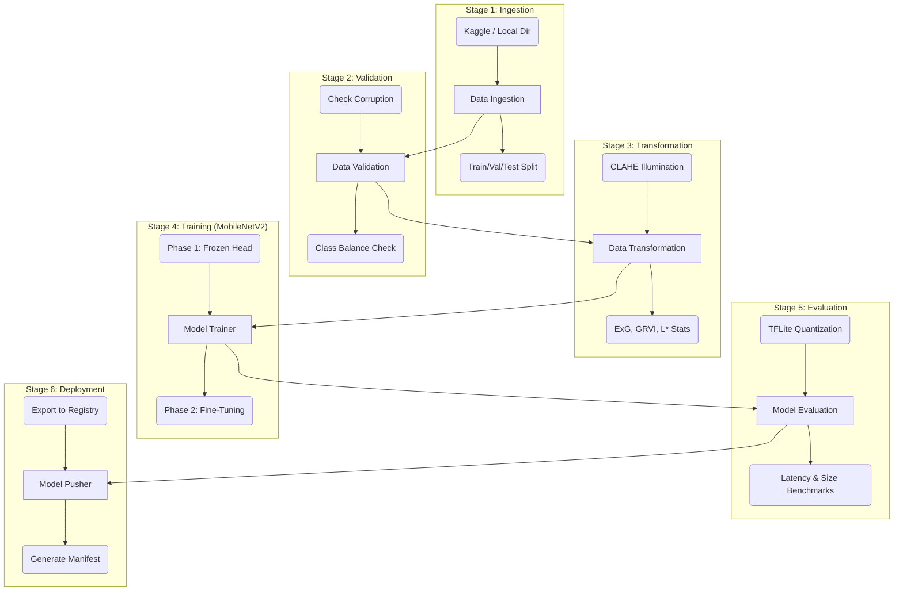
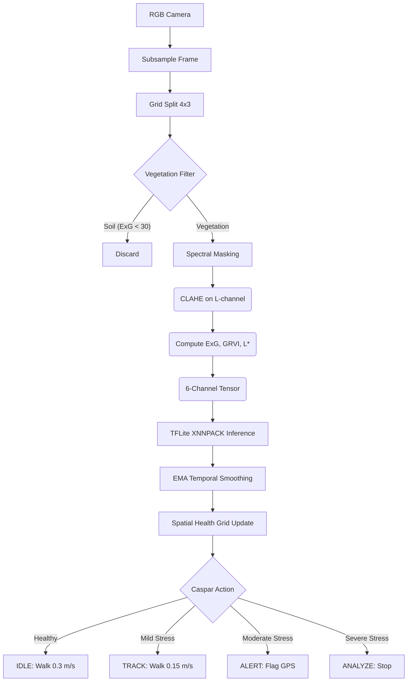

# MAGI Vision Pipeline Flowcharts

## 1. Training Pipeline Architecture

```mermaid
graph TD
    A[Data Ingestion] --> B[Data Validation]
    B --> C[Data Transformation]
    C --> D[Model Trainer]
    D --> E[Model Evaluation]
    E --> F[Model Pusher]

    subgraph "Stage 1: Ingestion"
    A1(Kaggle / Local Dir) --> A
    A --> A2(Train/Val/Test Split)
    end

    subgraph "Stage 2: Validation"
    B1(Check Corruption) --> B
    B --> B2(Class Balance Check)
    end

    subgraph "Stage 3: Transformation"
    C1(CLAHE Illumination) --> C
    C --> C2(ExG, GRVI, L* Stats)
    end

    subgraph "Stage 4: Training (MobileNetV2)"
    D1(Phase 1: Frozen Head) --> D
    D --> D2(Phase 2: Fine-Tuning)
    end

    subgraph "Stage 5: Evaluation"
    E1(TFLite Quantization) --> E
    E --> E2(Latency & Size Benchmarks)
    end

    subgraph "Stage 6: Deployment"
    F1(Export to Registry) --> F
    F --> F2(Generate Manifest)
    end
```

## 2. On-Robot Inference Pipeline (Melchior System)

```mermaid
graph TD
    C[RGB Camera] --> S[Subsample Frame]
    S --> G[Grid Split 4x3]
    G --> V{Vegetation Filter}
    
    V -- Soil (ExG < 30) --> D[Discard]
    V -- Vegetation --> P[Spectral Masking]
    
    P --> P1(CLAHE on L-channel)
    P1 --> P2(Compute ExG, GRVI, L*)
    P2 --> P3(6-Channel Tensor)
    
    P3 --> M[TFLite XNNPACK Inference]
    M --> SM[EMA Temporal Smoothing]
    SM --> H[Spatial Health Grid Update]
    
    H --> A{Caspar Action}
    A -- Healthy --> A1[IDLE: Walk 0.3 m/s]
    A -- Mild Stress --> A2[TRACK: Walk 0.15 m/s]
    A -- Moderate Stress --> A3[ALERT: Flag GPS]
    A -- Severe Stress --> A4[ANALYZE: Stop]
```
