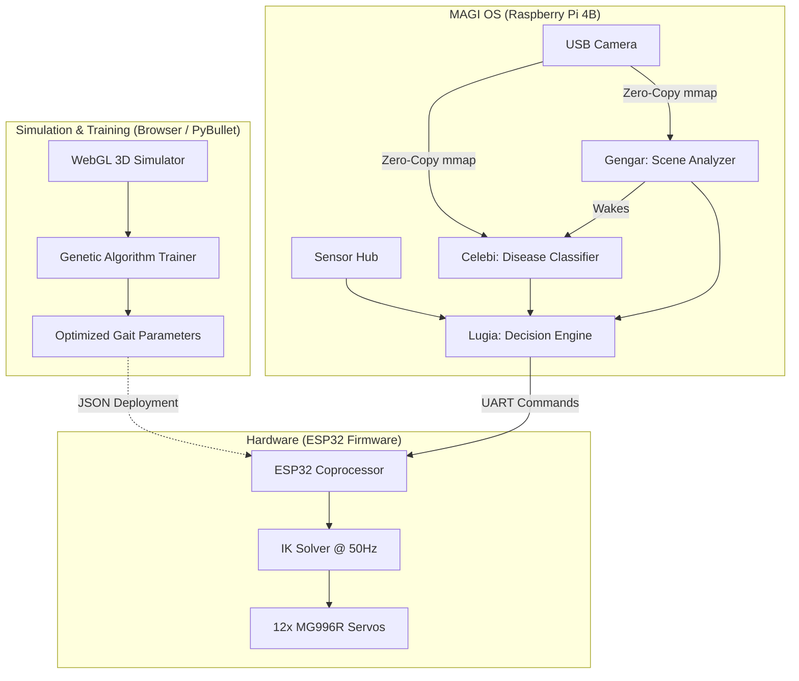

<div align="center">

# MAGI 
### Multispectral Autonomous Ground Intelligence

**Enterprise-Grade Quadruped Robotics Framework & Edge AI Operating System**

[](#license)
[](#hardware-overview)
[](#firmware--esp32-joint-controller)
[](#)
[](#)

---

MAGI is a comprehensive, production-ready autonomous robotics platform. It integrates a **12-DOF quadruped chassis**, a **custom low-latency embedded operating system**, **lifecycle-gated edge AI inference**, and a **browser-based simulation/training environment** into a single cohesive framework.

Originally engineered for precision agriculture—navigating uneven crop rows and diagnosing plant health entirely offline—MAGI is designed to operate within the strict constraints of edge devices like the Raspberry Pi 4B.

</div>

---

## 📑 Table of Contents
- [Key Features](#-key-features)
- [System Architecture](#-system-architecture)
- [Directory Structure](#-directory-structure)
- [Quick Start](#-quick-start)
  - [1. Simulation](#1-browser-simulation)
  - [2. Docker Deployment](#2-docker-mock-deployment)
  - [3. Hardware Deployment](#3-hardware-deployment)
- [Core Technologies](#-core-technologies)
- [Research & Documentation](#-research--documentation)
- [License & Contributing](#-license--contributing)

---

## 🚀 Key Features

- **Micro-Services Architecture:** Replaces heavy middleware (like ROS2/DDS) with a lightweight, native Python + ZeroMQ implementation, consuming only ~22MB of RAM compared to ROS2's ~200MB.
- **Lifecycle-Gated AI Inference:** The OS orchestrates three concurrent AI models (Celebi, Gengar, and Lugia). Intensive models like the Celebi disease classifier remain suspended until triggered by the Gengar scene analyzer, reducing CPU utilization by 34% and thermal dissipation by 8°C.
- **Zero-Copy Memory Sharing:** Achieves maximum throughput for high-resolution camera frames using POSIX shared memory (`mmap`), avoiding costly serialization overhead.
- **Sim-to-Real RL Training:** Includes a zero-install, browser-based WebGL simulation environment that uses Genetic Algorithms to evolve optimal gait parameters (stride, sway, phase offsets) before deploying them to the physical robot.
- **Hard Real-Time Locomotion:** Offloads inverse kinematics (IK) and cubic Bézier gait generation to an ESP32 coprocessor running at 50Hz, ensuring buttery-smooth servo actuation independent of Linux OS scheduling.

---

## 🏗 System Architecture

The MAGI ecosystem is composed of three deeply integrated layers:



### The Three AI Cores
1. **Celebi (MAGI-1):** The heavy Disease Classification Core. A quantized MobileNetV2 model that analyzes multi-spectral inputs to diagnose plant health.
2. **Gengar (MAGI-2):** The Scene Analysis Core. A lightweight EfficientNet-Lite model that evaluates the environment and acts as a wake-trigger for Celebi.
3. **Lugia (MAGI-3):** The Decision & Fusion Engine. Fuses inputs from Celebi, Gengar, and hardware sensors to dictate the robot's locomotion state (IDLE, TRACK, ALERT, EMERGENCY).

---

## 📁 Directory Structure

```text
MAGI/
├── AIML MODELS/               # Optimized .tflite weights for edge inference
├── firmware/                  # ESP32 C++ firmware (PlatformIO)
├── HeatMAP/                   # MLOps pipeline and Streamlit dashboard
├── mathworks-Simscape.../     # MATLAB Simscape physical simulation
├── model &miscellenious/      # 3D printable chassis STLs and CAD files
├── OS/                        # Raspberry Pi operating system and AI nodes
├── Research paper/            # IEEE LaTeX research paper outlining the architecture
└── simulation/                # Browser-based PyBullet/WebGL simulator
```
*(Detailed READMEs are available inside each respective directory).*

---

## ⚙️ Quick Start

### 1. Browser Simulation
Run the 3D physics simulation and gait trainer entirely in your browser.
```bash
cd simulation
python3 -m http.server 8765
# Navigate to http://localhost:8765 in your browser
```

### 2. Docker Mock Deployment
Test the OS and AI inference stack on your local machine using hardware mocks.
```bash
cd OS/docker
docker compose build
docker compose up -d
docker compose logs -f magi3    # Monitor the Lugia decision engine
```

### 3. Hardware Deployment
Deploy the MAGI OS to a Raspberry Pi 4B running Debian Bookworm 64-bit.
```bash
# 1. Transfer OS files to Raspberry Pi
scp -r OS pi@<RPI_IP_ADDRESS>:~/magi-os

# 2. SSH into Raspberry Pi and run setup scripts
ssh pi@<RPI_IP_ADDRESS>
sudo bash ~/magi-os/setup/01_strip_os.sh && sudo reboot
sudo bash ~/magi-os/setup/02_install_deps.sh
sudo bash ~/magi-os/setup/03_configure_boot.sh && sudo reboot
sudo bash ~/magi-os/setup/04_install_services.sh

# 3. Start the system watchdog
sudo systemctl start magi-watchdog
```

---

## 🛠 Core Technologies

- **Software & OS:** Python 3.12+, ZeroMQ, POSIX IPC, FastAPI, Docker, Systemd
- **Machine Learning:** TensorFlow Lite, XNNPACK, MobileNetV2, EfficientNet-Lite
- **Firmware & Embedded:** C++, PlatformIO, ESP32, I²C (PCA9685, MPU-6050)
- **Simulation:** Three.js (WebGL), PyBullet, MATLAB Simscape
- **Manufacturing:** 3D Printed PLA/PETG, MG996R Servos

---

## 📚 Research & Documentation

The architectural decisions and performance benchmarks behind MAGI are documented in our formal research paper:

> **"Edge-Optimized Spectral Masking with Lifecycle-Gated Inference for Real-Time Agricultural Diagnostics on a Resource-Constrained Quadruped"**

The full LaTeX source and compiled PDF can be found in the [`Research paper/`](Research%20paper/) directory.

---

## 📄 License & Contributing

This project is licensed under the **MIT License**.

We welcome contributions from the open-source community! If you are interested in improving the inverse kinematics solvers, optimizing the TFLite models, or expanding the simulation environments, please feel free to open a Pull Request or Issue.

<div align="center">
  <sub>Built with ❤️ by the MAGI Robotics Team</sub>
</div>
